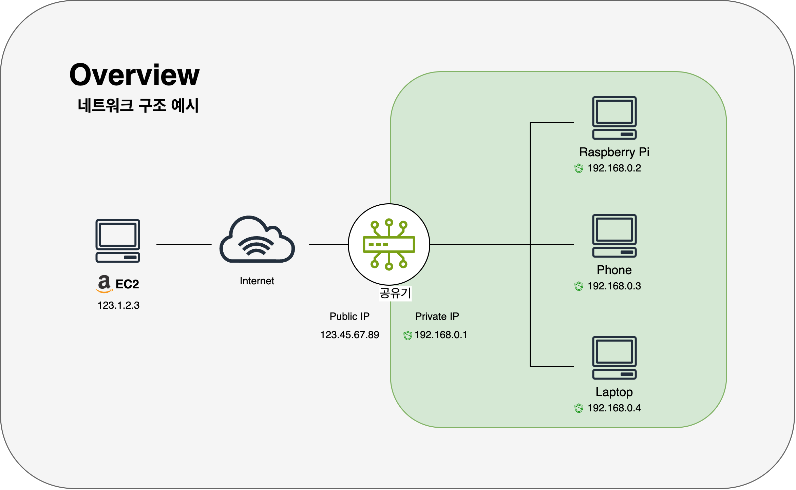

# MSA 확장 서버 : `dontgoback-extension-server`

# 1. 프로젝트 개요

### 소개

`dontgoback-extension-server`는 `DontGoBack` 프로젝트의 확장 마이크로서비스로,  
코어 서버의 부가 기능을 담당하는 백엔드 서비스입니다.

인증 서버(`dontgoback-auth-server`)로부터 JWT를 발급받은 코어 서버는,  
이 토큰을 포함하여 확장 서버에 요청을 보냅니다.

확장 서버는 모든 요청에 대해 해당 JWT의 유효성을 검사 후 비즈니스 로직을 수행합니다.

개발 및 배포는 **경량화된 인프라(Raspberry Pi)** 를 기반으로 하며, 단위, 통합 테스트를 실행하고,  
Docker + GitHub Actions 기반 CI/CD 파이프라인을 구축하였습니다.

### 기간

- 2025.08.02 \~ (진행 중)

### 인원

- 개인 프로젝트

### 기술 스탭

|      번류      |            도구            |  버전  |
| :------------: | :------------------------: | :----: |
|      언어      |            Java            |   21   |
|    Backend     |        Spring Boot         | 3.4.0  |
|  인증/암호화   |        jjwt (RS256)        | 0.11.5 |
|     테스트     | JUnit5 / Mockito / MockMvc |  최신  |
| Infrastructure |        Raspberry Pi        |   -    |
|     DevOps     |  GitHub Actions / Docker   |   -    |

### 연관 프로젝트

- 코어 서버 GitHub 주소:
  [https://github.com/core](https://github.com/parkhongseok/projectDontGoBack)

- 인증 서버 GitHub 주소:
  [https://github.com/auth](https://github.com/parkhongseok/dontgoback-auth-server)

 
 
 

# 2. 주요 기능

### ① 공개키 기반 JWT 검증

- 인증 서버에서 `/msa/auth/api/public-key` 로부터 1회 요청을 통해 공개키를 로딩
- `X509EncodedKeySpec` 방식으로 파싱 후 메모리에 저장하여, 모든 요청 검증에 재사용

 

### ② 로그정규 기반 닉네임 갱신 서비스

- 코어 서버로부터 `/msa/auth/api/asset` 요청을 받아, 자산 정보를 반환
- 코어 서버는 이를 바탕으로 유저 자산 이력을 갱신하고, 최신 자산을 닉네임에 자동 반영
- 로그 정규를 통한 기존 자산의 갱신값을 반환

 

### ③ 통합 인증 테스트 구성

- 실제 인증 서버로부터 공개키 및 JWT를 발급받고, 검증까지 포함한 흐름을 테스트
- 정상 및 실패 케이스 모두 포함하며, CI 환경에서도 확장 가능

 

### ④ 빌드 및 배포 자동화

- Docker 기반 컨테이너화
- GitHub Actions 기반 CI/CD 자동화
- 빌드 캐시 통한 배포 시간 **501초에서 6초로 단축**

 
 
 

# 3. 아키텍처

## 3-1. 시스템 아키텍처

1. **dg-core-server** : 기존 기능(도메인 기능) 수행, 내부 서버 오케스트르레이션
2. **dg-auth-server** : S256 기반 JWT 발급·공개키 제공
3. **dg-extension-server** : 공개키로 검증 후 확장 API(유저 자산 갱신 등)를 제공

 
 

## 3-2. 네트워크 아키텍처

가정용 공유기 환경의 라즈베리파이를 외부 공개 서버로 구축한 아키텍처입니다.

- DDNS와 개인 도메인의 CNAME 레코드를 조합하여 유동적인 공인 IP 문제를 해결하고, DHCP 예약으로 내부 IP를 고정했습니다.

- 외부 요청은 포트포워딩을 통해 내부 서버로 전달되며, Let's Encrypt 인증서와 UFW 방화벽을 통해 HTTPS 기반의 이중 보안 계층을 확보했습니다.

 
 

## 3-3. 빌드 및 배포 자동화 아키텍처

- `git push`를 통해 MSA 애플리케이션을 라즈베리파이에 자동 배포하는 GitHub Actions 기반의 CI/CD 아키텍처입니다.

- 외부 컨테이너 레지스트리 없이, **SSH 스트리밍**으로 Docker 이미지를 서버에 직접 전송하여 배포 속도와 단순성을 확보했습니다.

- **ARM64 크로스 빌드**를 지원하며, GitHub Actions 캐시를 활용해 빌드 시간을 90% 이상 단축시켰습니다.  
  (최대 501초에서 6초로 단축)

- 또한, 배포 후 **자동 검증(Smoke Test)** 과 실패 시 로그 수집 기능으로 운영 안정성을 높였습니다.

 
 

본 프로젝트의 주요 결정 기록은 [`docs/architecture/decisions`](./docs/architecture/decisions) 디렉터리에서 확인하실 수 있습니다.

 
 
