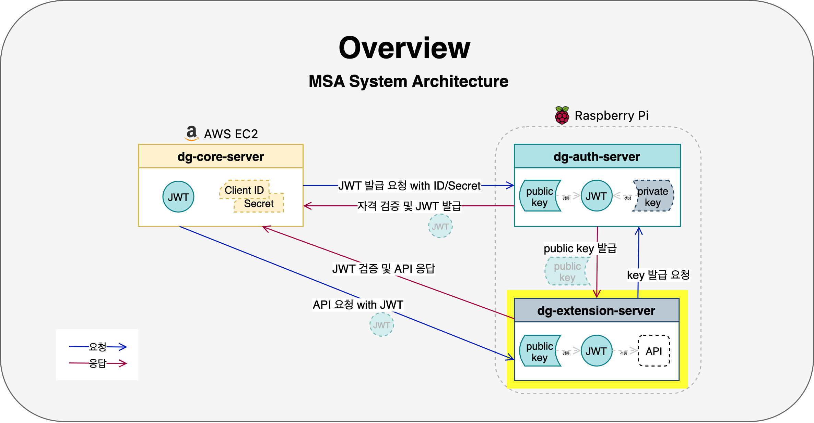
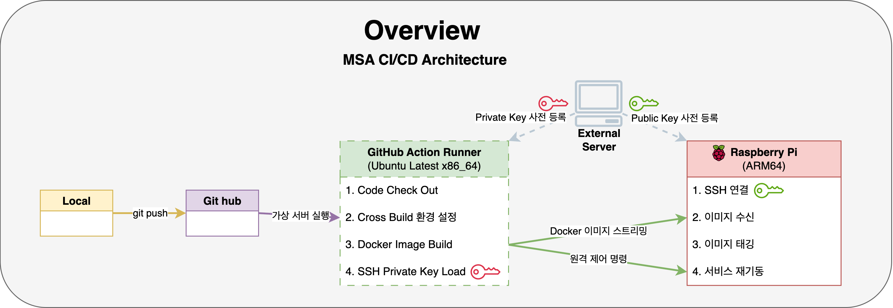

# dontgoback-extension-server

 

"DontGoBack MSA 프로젝트의 핵심 도메인 기능을 보조하는 확장 서비스"

 

> 이 프로젝트는 '돈고백(Dont Go Back)' MSA 프로젝트의 일부입니다.  
> 전체 프로젝트의 개요 및 성과는 **[코어 서버 README](https://github.com/parkhongseok/projectDontGoBack)** 에서 확인하실 수 있습니다.

 

## 1. 핵심 역할

이 서버는 코어 서버의 책임을 분리하고 확장 기능을 전담하는 마이크로서비스로서, 다음과 같은 역할을 수행합니다.

- **OAuth 2.0 리소스 서버 (Resource Server):**
  - `dg-core-server`의 요청을 받아 처리하는 보호된 자원(API)을 제공합니다.
- **JWT 기반 요청 검증:**
  - 모든 API 요청에 대해 `dg-auth-server`로부터 받은 **공개키를 이용해 JWT의 유효성을 검증**합니다.
- **확장 기능 API 제공:**
  - **사용자 자산 변동 시뮬레이션**, 닉네임 생성 등 핵심 비즈니스 로직과 분리된 부가 기능을 API 형태로 제공합니다.

 

## 2. 주요 기술 구현

#### 1. **JWT 요청 검증 필터 (Request Validation Filter)**

- Spring Security의 `OncePerRequestFilter`를 확장하여, 모든 API 요청에 대해 **`Authorization: Bearer {JWT}`** 헤더를 확인하는 커스텀 필터를 구현했습니다.
- 추출된 JWT가 인증 서버의 공개키로 서명되었는지, 만료 시간은 유효한지 등을 검증하여 통과된 요청만 Controller로 전달합니다.

#### 2. **공개키 동기화 및 캐싱 (Public Key Caching)**

- 서버가 시작될 때 인증 서버(`dg-auth-server`)의 Public Key API를 호출하여 **공개키를 가져와 메모리에 캐싱**합니다.
- 이를 통해 매 요청마다 공개키를 요청하는 네트워크 오버헤드를 제거하고, 인증 서버 장애 시에도 캐시된 키로 검증을 계속 수행할 수 있도록 하여 서비스 안정성을 높였습니다.

#### 3. **자산 변동 시뮬레이션 로직 설계**

- 단순 균등 분포(Uniform Distribution)의 한계를 넘어, 자산 가치가 음수가 되지 않고 변동률이 곱셈적으로 적용되는 **도메인의 특성을 더 잘 반영**하기 위해 **_로그정규(Log-normal) 분포 모델_** 을 도입하여 시뮬레이션 로직을 설계했습니다.

- 외부 의존성 없이 **Caffeine 로컬 캐시**를 활용하여 '하루 1회, 동일한 변동률 적용'이라는 비즈니스 요구사항을 일관성 있게 보장하며 성능을 확보했습니다

> 📌 **관련 ADR:** [로그정규 분포 기반 일일 자산 임의 갱신](./docs/architecture/decisions/로그정규-분포-기반-일일-자산-임의-갱신.md)

 

## 3. 기술 스택

| 구분               | 기술                                       |
| :----------------- | :----------------------------------------- |
| **Backend**        | Java 21, Spring Boot, Spring Security, JPA |
| **Authentication** | jjwt (JSON Web Token for Java)             |
| **Database**       | MariaDB                                    |
| **DevOps & Infra** | Docker, GitHub Actions, Raspberry Pi       |

 

## 4. 아키텍처

### MSA 내에서의 역할

  

- 인증 서버로부터 공개키를 받고, 코어 서버로부터 API 요청을 받아 비즈니스 로직을 처리한 후 응답하는 역할을 담당합니다.

 

### 배포 자동화 (CI/CD on Raspberry Pi)

  

- GitHub Actions를 통해 **ARM64 아키텍처의 라즈베리파이에 맞게 크로스 빌드** 됩니다.
- 외부 컨테이너 레지스트리 없이, **SSH 스트리밍으로 Docker 이미지를 서버에 직접 전송**하여 배포 속도와 단순성을 확보했습니다.
- 배포 후 **Smoke Test**를 통해 API가 정상 응답하는지 자동으로 검증합니다.
